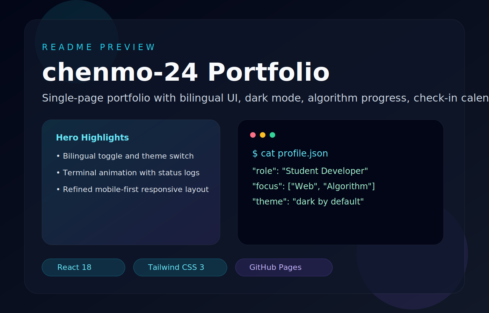

<div align="center">

# chenmo-24 Portfolio



**[中文](#中文) | [English](#english)**

</div>

---

<a id="中文"></a>

## 中文

这是一个基于 **Vite + React 18 + Tailwind CSS** 构建的单页个人作品集。项目支持中英文切换、深浅色主题切换、命令面板、项目展示、成长路线和多个可交互模块，并已按 GitHub Pages 部署方式配置。

### 技术栈

- **Vite 5**：开发服务与生产构建
- **React 18**：组件化界面
- **Tailwind CSS 3**：原子化样式
- **Lucide React**：图标系统

### 功能亮点

- 默认中文界面，支持中英文切换
- 默认深色主题，支持浅色主题切换
- 单页滚动导航，当前区块自动高亮
- Hero 终端卡片、项目展示、成长地图和联系信息
- `Cmd/Ctrl + K` 全局命令面板，可快速跳转模块
- Fun Zone 互动模块：
  - 算法进度
  - 算法可视化寻路：BFS、DFS、Dijkstra、A*
  - 技能雷达
  - 每日语录
  - Now 页面
  - 打卡日历
  - GitHub 活跃度
  - 交互式终端
  - Terminal Quest 解谜
  - 代码打字挑战
  - Bug Hunt
  - 代码人格测试
  - 贪吃蛇
  - 2048
  - 康威生命游戏

### 本地运行

```bash
npm install
npm run dev
```

默认访问地址：

```text
http://localhost:5173/my-portfolio/
```

如果 Vite 缓存没有更新，可以强制启动：

```bash
npm run dev -- --force
```

### 构建与预览

```bash
npm run build
npm run preview
```

生产预览通常访问：

```text
http://localhost:4173/my-portfolio/
```

### GitHub Pages 部署

项目已经按 GitHub Pages 配置：

- `vite.config.js` 中的 `base: "/my-portfolio/"`
- `.github/workflows/deploy.yml` 用于 GitHub Actions 自动部署
- `index.html` 中配置了 favicon、OG 和 Twitter Card 信息
- `public/og-cover.svg` 用作社交分享封面

推送到 GitHub 后，进入仓库：

1. 打开 **Settings**
2. 进入 **Pages**
3. 在 **Build and deployment** 中选择 **GitHub Actions**
4. 之后每次推送到 `main` 都会自动构建并部署

### 上传到 GitHub

提交前先确认 `.gitignore` 已忽略本地配置：

```bash
git status --short
```

推荐只添加项目文件，不要使用 `git add .`：

```bash
git add README.md .gitignore package.json package-lock.json index.html vite.config.js tailwind.config.js postcss.config.js public src .github
git status --short
git commit -m "Update portfolio site"
git push origin main
```

如果还没有绑定远程仓库：

```bash
git remote add origin https://github.com/chenmo-24/my-portfolio.git
git branch -M main
git push -u origin main
```

### 不要提交的本地文件

以下内容已在 `.gitignore` 中忽略：

- `node_modules/`
- `dist/`
- `.vite/`
- `.claude/`
- `.vscode/`
- `.idea/`
- `.env`、`.env.*`
- `.DS_Store`
- `Thumbs.db`

### 项目结构

```text
my-portfolio/
|-- index.html
|-- package.json
|-- vite.config.js
|-- tailwind.config.js
|-- postcss.config.js
|-- README.md
|-- .github/workflows/deploy.yml
|-- public/
|   |-- favicon.svg
|   |-- og-cover.svg
|   `-- readme-preview.svg
`-- src/
    |-- main.jsx
    |-- App.jsx
    |-- index.css
    |-- data/
    |-- components/
    `-- hooks/
```

### 常用修改位置

| 修改内容 | 文件 |
| --- | --- |
| 个人信息 | `src/data/personalInfo.js` |
| 项目数据 | `src/data/projects.js` |
| 每日语录 | `src/data/quotes.js` |
| 算法进度 | `src/data/algorithmProgress.js` |
| 技能雷达 | `src/data/skills.js` |
| Now 页面 | `src/data/nowPage.js` |
| GitHub 活跃度 | `src/data/githubStats.js` |
| 打字片段 | `src/data/codeSnippets.js` |
| 算法可视化 | `src/components/AlgorithmVisualizer.jsx` |
| 打卡日历 | `src/components/CheckinCalendar.jsx` |
| Hero 终端 | `src/components/Hero.jsx` |
| 全局样式 | `src/index.css` |

---

<a id="english"></a>

## English

A single-page portfolio built with **Vite + React 18 + Tailwind CSS**. It includes bilingual UI, theme switching, a command palette, project showcases, a growth timeline, and multiple interactive Fun Zone modules. It is configured for GitHub Pages deployment through GitHub Actions.

### Stack

- **Vite 5** for dev server and builds
- **React 18** for component-based UI
- **Tailwind CSS 3** for styling
- **Lucide React** for icons

### Run Locally

```bash
npm install
npm run dev
```

Open:

```text
http://localhost:5173/my-portfolio/
```

### Build

```bash
npm run build
npm run preview
```

### Deploy

Push the repository to GitHub and enable **Settings -> Pages -> Build and deployment -> GitHub Actions**.

---

<div align="center">

Built with React by [chenmo-24](https://github.com/chenmo-24)

</div>
